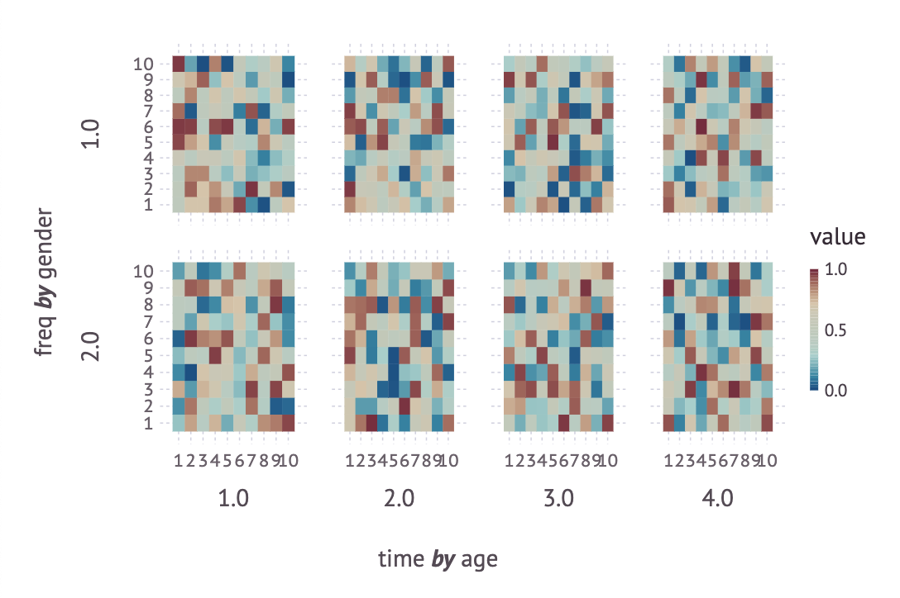

# PlotAxes

[](https://www.repostatus.org/#active)
[](https://travis-ci.org/haberdashPI/PlotAxes.jl)
[](https://ci.appveyor.com/project/haberdashPI/plotaxes-jl/branch/master)
[](https://codecov.io/gh/haberdashPI/PlotAxes.jl)

PlotAxes is intended to simplify the visualization of medium dimensional data
(e.g. 4-5 dimensions max) during an interactive session. It is *not*
intended as a full fledged plotting API for publication quality graphs.

It can be used to plot an `AbstractArray` or
[`AxisArray`](https://github.com/JuliaArrays/AxisArrays.jl). Supported
backends are described in the documentation of `PlotAxes.list_backends`. With
an `AxisArray` the axes will be properly labeled.

To use it, just call `plotaxes`, as follows.

```julia
using PlotAxes, AxisArrays, Gadfly # replace Gadfly with VegaLite or RCall as desired

plotaxes(AxisArray(rand(10,10,4,2),:time,:freq,:age,:gender))
```

This code results in the following figure:



For more details, see the documentation for `plotaxes` (ala ? at the REPL).

## Status

This is working for display of data in my day-to-day work. It has a fairly
minimal number of features, as it intended for my initial, rapid plotting,
and I employ a specific backend for more detailed, publication quality
figures. There are plenty of features that might be added or backends that
could be implemented. In the long-term I would like to make the `plotaxes`
command easily composable with the other features of each backend.
